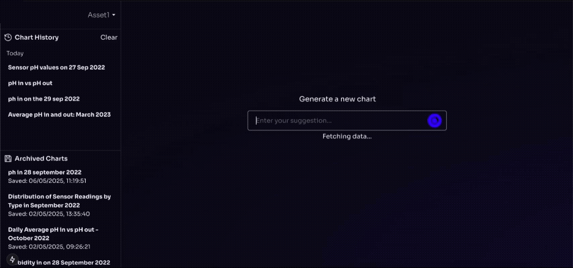

# Data Visualisation with RAG

This is a Retrieval-Augmented Generation (RAG) system for interpreting natural language queries and visualizing data.

## Features

- Natural language query interpretation
- Embedding-based template matching
- Dynamic time and sensor parsing
- Chart.js visualization config via LLM
- 3 Pipeline fallback architecture for cost reduction (Manual, Embedding, Full LLM)

## How It Works

1. User inputs a natural language query.
2. The system embeds and matches it to a pre-defined query template.
3. Extracted variables (date, time, sensor) are inserted into a MongoDB query.
4. Contextual data is generated from real-time sensor data (statistical summaries)
5. The contextual data + original prompt is sent to an LLM to generate a Chart.js config.
6. Raw sensor data is filled onto the chart code
7. Chart is rendered on the frontend.

## Tech Stack

- FastAPI (Python)
- Next.js (React, TypeScript)
- Embedding model (all-MiniLM-L6-V2)
- LLM (Google Gemini 1.5 Flash)

